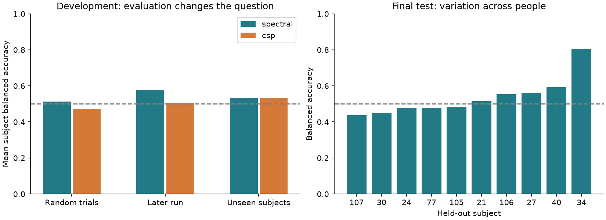
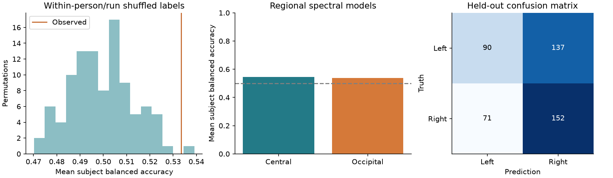

# What does this motor imagery classifier establish?

The frozen **spectral** model achieved **53.6% mean per-subject balanced accuracy** on 10 held-out people (450 usable trials). The subject-bootstrap 95% interval is **48.3%–60.2%**. This interval resamples the observed people; it does not cover all sources of uncertainty.

The interval includes 50%. This small held-out test does not establish reliable above-chance generalization; the positive development permutation result does not override that uncertainty.

This is an offline, cue-aligned, same-dataset experiment. It does not establish online control, cross-day performance, transfer to other devices, or that the source of every predictive feature is motor imagery.

## Data and preprocessing

A seeded permutation (seed 20260911) selected 40 of 109 people before fitting: 30 development and 10 held out. All three imagery runs (4, 8, 12) were requested for each person. Development IDs: [51, 64, 100, 74, 15, 42, 36, 70, 109, 75, 20, 10, 57, 91, 25, 11, 87, 97, 48, 73, 101, 26, 59, 89, 68, 14, 39, 18, 55, 82]. Held-out IDs: [40, 21, 34, 77, 107, 105, 106, 30, 24, 27].

The audit contains 120 recording entries, 0 unreadable/excluded recordings, 1791 task cues, 0 unusable events, and 1417 high-amplitude flags. The raw sampling rates observed were [128.0, 160.0]. Every downloaded EDF was checked against PhysioNet's SHA256 manifest. Full durations, original channel names, counts, flags and exclusions are in results/audit_*.json and results/events_*.csv.

T1 means left and T2 means right only in the supported unilateral imagery runs. We extract [1,4) seconds after the cue, require at least four seconds of annotated task duration, standardize channel order, average-reference each trial, resample that isolated trial to 160 Hz if necessary, and apply a fourth-order Butterworth 8–30 Hz bandpass forward and backward with one second of reflected padding on each side. No samples from adjacent trials enter filtering. Reflection creates edge assumptions; the one-second cue delay reduces early evoked responses but does not eliminate sustained cue information.

EEG is measured in volts. A raw-channel peak-to-peak value above 200 µV is flagged; finite complete trials remain in the primary score. Entirely flat and nonfinite trials are unavailable. Individual flat channels are flagged and retained. No manual cleaning, ICA, interpolation, or test-person calibration is performed. The flagged-trial sensitivity analysis reuses the fitted model and removes only flagged evaluation trials; it is not a separately trained clean-data model.

## Models and selection

The spectral model uses Welch power (one-second Hann windows, 50% overlap), summed over 8≤f<13 and 13≤f<30 Hz per channel, then log power, training-fitted standardization, and logistic regression (C=1). The CSP model learns four spatial components with Ledoit–Wolf covariance regularization, then shrinkage LDA. CSP combines electrodes to emphasize class-dependent power; these are statistical patterns, not localized brain sources.

Five development folds hold out entire people. Both model configurations were fixed in advance. CSP wins only if its mean subject balanced accuracy exceeds the spectral model by at least one percentage point. Every scaler, CSP fit, and classifier uses training data only. The selected pipeline is then fitted on all usable development trials, hashed, and evaluated once on the held-out people. Test people remain excluded from the shipped model.

## Results

| Development experiment | Subject balanced accuracy | Training score | Ordinary accuracy |
|---|---:|---:|---:|
| random_spectral | 51.3% | 64.3% | 51.2% |
| later_run_spectral | 57.8% | 65.4% | 57.5% |
| grouped_spectral | 53.3% | 66.0% | 53.3% |
| random_csp | 47.3% | 55.6% | 47.6% |
| later_run_csp | 50.6% | 55.5% | 51.0% |
| grouped_csp | 53.3% | 58.8% | 53.2% |
| grouped_majority | 50.0% | 50.0% | 50.8% |
| grouped_metadata | 49.8% | 50.2% | 50.0% |
| grouped_central | 54.4% | 58.5% | 54.4% |
| grouped_occipital | 53.9% | 55.8% | 54.1% |

Random splits share people and runs; later-run splits share people; grouped splits share neither people nor their runs. The different scores describe different deployment conditions. Their difference is not a causal estimate of identity leakage because training sets and sample sizes also differ. Training scores are resubstitution scores averaged over folds and are optimistic by construction.

Held-out ordinary accuracy is 53.8%; pooled balanced accuracy is 53.9%. The training-majority baseline achieves 50.4% ordinary accuracy and 50% balanced accuracy. Individual balanced accuracies range from 43.8% to 80.7%. Excluding high-amplitude test trials retains 15.6% of usable trials and yields 62.6%. The remaining subset contains only 70 trials from 2 people; this is not evidence of improvement from cleaning. Subject-level scores are in results/test_subjects.csv.

## Alternative explanations and the open-ended investigation

The fixed spectral pipeline's observed grouped score is 53.3%. Across 100 within-person/run label permutations, the plus-one reference p-value is 0.0198. Scaling and classification are refitted in every fold for every permutation. This is a limited exchangeability reference: shuffling destroys temporal label structure, so it does not rule out order effects, artifacts, or visual information.

Predicting person identity from runs 4/8 and evaluating on run 12 achieved 95.7% accuracy, versus 3.3% uniform chance and 3.4% majority accuracy. This quantifies persistent person/recording information, not its causal contribution to left/right predictions.

The metadata-only logistic model uses run number and task-event position. It tests a simple order/imbalance explanation; failure of this linear control does not exclude nonlinear schedules. The majority predictor is learned from each training fold. These controls are stronger context than a bare 50% reference but are not exhaustive.

The central-only spectral model scored 54.4%; the occipital-only model scored 53.9%. Each uses its own within-group reference, the same trials, and the same held-out-person folds. Central channels are Fc3/Fc1/Fcz/Fc2/Fc4, C3/C1/Cz/C2/C4, Cp3/Cp1/Cpz/Cp2/Cp4. Occipital channels are Po7/Po3/Poz/Po4/Po8/O1/Oz/O2. The groups differ in size, so this is a diagnostic, not a controlled localization experiment.

The dataset's left/right visual target is correlated with the requested movement. Occipital predictability can be consistent with visual responses, volume conduction, or other shared signals; it cannot isolate their causes. A low occipital score would likewise not prove motor specificity. This cue/task entanglement is the weakest point in a claim of pure motor imagery decoding.

## Additional discovery: inconsistent sampling metadata

The development audit found non-160-Hz EDF headers for subjects [100]. Subject 100's three runs report 128 Hz and task annotations around 5.1 seconds, compared with about 4.1 seconds in most recordings. This was found before model fitting. We follow the header's stated rate and resample; we cannot establish from these files alone whether the metadata or acquisition timing is wrong.

A prespecified-after-audit sensitivity check removes these subjects from both training and validation while preserving the original fold assignments for everyone else. The fixed spectral model scores 54.4% mean subject balanced accuracy. This is a descriptive robustness check on a different cohort, not a reason to replace the original primary result or select a different model. No held-out data informed this check.

## Design decision, limits, and next steps

We chose two small power-based models instead of a neural network. Their transforms can be inspected, they fit quickly on CPU, and this preserves time for split comparisons and raw-EDF consistency checks. The alternative could learn richer structure, but extra capacity would not resolve cue confounding or make a random trial split a valid estimate for a new person.

The strongest defensible claim is limited to the observed held-out EEGMMIDB people and this preprocessing. Forty selected people are not a representative sample of every BCI user. Quality thresholds and the fixed time window affect coverage. The bootstrap is conditional on the selected model and observed subjects. The selected model's development score has selection optimism; the holdout is the final independent check. Class balance, temporal dependence, and residual artifacts remain limitations. No accuracy threshold was used to exclude a person.

The fixed raw-amplitude threshold flags many trials. The unflagged analysis can remove entire people and can leave only one class for others. Mean subject balanced accuracy excludes people without both remaining classes; JSON summaries explicitly report this coverage. Therefore its score is conditional on a changed cohort and should not be described as a controlled estimate of the benefit of cleaning.

With more time: expand the prespecified cohort, compare independent recording days/devices, use a protocol separating cue direction from imagined hand, add stronger temporal/order controls, test reference and time-window sensitivity under nested subject validation, and then compare a compact neural model with the same splits. Separate calibration-enabled performance from truly unseen-person inference.

## Reproducibility and sources

See README.md for locked installation and commands. results/experiments.jsonl records attempts and timings; config/split.json records subject selection; artifacts/test_freeze.json records the exact evaluated model hash. Trial-level predictions include subject/run/event/fold membership. Preprocessing and annotations used for extraction are shared with the prediction CLI; annotation class codes never enter its model features.

- [PhysioNet EEGMMIDB 1.0.0 and protocol](https://physionet.org/content/eegmmidb/1.0.0/)
- [MNE run mapping](https://mne.tools/stable/generated/mne.datasets.eegbci.load_data.html)
- [MNE CSP example](https://mne.tools/stable/auto_examples/decoding/decoding_csp_eeg.html) — methodological reference; its hands/feet example is not our left/right task.
- Schalk et al. (2004), BCI2000, IEEE TBME 51(6):1034–1043, doi:10.1109/TBME.2004.827072.
- Goldberger et al. (2000), PhysioBank, PhysioToolkit, and PhysioNet, Circulation 101(23):e215–e220.
